# A general IHTC model for hot/warm aluminium stamping 

Xiaochuan Liu ${ }^{\mathrm{a}, \mathrm{c}}$, Zhaoheng Cai ${ }^{\mathrm{a}}$, Yang Zheng ${ }^{\mathrm{a}}$, Omer El Fakir ${ }^{\mathrm{a}}$, Joao Gandra ${ }^{\mathrm{b}}$, LiLiang Wang ${ }^{\mathrm{a}, *}$ ${ }^{\mathrm{a}}$ Department of Mechanical Engineering, Imperial College London, London SW7 2AZ, UK ${ }^{\mathrm{b}}$ The Welding Institute, Granta Park, Great Abington, Cambridge CB21 6AL, UK ${ }^{\mathrm{c}}$ School of Mechanical Engineering, Xi'an Jiaotong University, Xi'an, 710049, People's Republic of China

H I G H L I G H T S

- A method was developed to identify the critical process parameter in hot/warm stamping.
- A general aluminium alloy-independent IHTC model was developed.
- The critical contact pressures for AA6082 and AA7075 were identified.
- Dissimilar aluminium alloys were formed to experimentally verify the present work.

## ARTICLE INFO

Keywords:
Alloy-independent IHTC model
Critical processing parameters
Hot and warm stamping
Dissimilar joining
Aluminium alloys
Friction stir welding

#### Abstract

Different hot and warm stamping technologies with particular processing parameters were applied to deform aluminium alloy sheets to satisfy desired requirements, of which the post-form strength of formed components is one of the most important criteria. In order to save experimental efforts, the present research described an efficient method to determine the critical processing parameters, i.e. the integration of the finite element (FE) simulated temperature evolutions with the continuous cooling precipitation (CCP) diagrams of the aluminium alloys. Through the optimisation of the processing parameters, the temperature evolutions and CCP diagrams do not intersect, indicating that the post-form strength of the aluminium alloys could be fully retained after proper artificial ageing processes. Therefore, a precise FE simulation of the temperature evolution is of great importance to this method, which requires the implementation of an accurate interfacial heat transfer coefficient (IHTC) as a decisive boundary condition. A general aluminium alloy-independent model with one set of fixed model constants was therefore developed to predict the IHTC evolutions as a function of contact pressure, surface roughness, initial blank temperature, initial blank thickness, tool material, coating material and lubricant material. Subsequently, the predicted IHTCs for AA6082 and AA7075 aluminium alloys were used to simulate their temperature evolutions, which were then integrated with their CCP diagrams to identify the critical processing parameters in hot/warm stamping processes and thus meet the desired post-form strength of the AA6082 and AA7075. The developed IHTC model and determined critical processing parameters were then experimentally verified by the Fast light Alloy Stamping Technology (FAST) of the dissimilar aluminium alloy blanks joined by Friction Stir Welding (FSW).

## 1. Introduction

The growing trend of transport electrification introduces specific lightweight challenges, especially in the automotive sector. Manufacturers are working to reduce the weight of the vehicle structure to improve its running efficiency and performance. This is typically achieved by structural topology optimisation and trading traditional steel fabrication for lightweight materials [1]. Aluminium alloys are one of the most commercially viable options due to their attractive strength-to-weight ratio, corrosion resistance, good recyclability and ease of joining. Furthermore, the application of lightweight aluminium alloys is beneficial for reducing carbon dioxide emissions and saving fuel consumption. It was found that carbon dioxide emissions could be reduced by 10\% when a vehicle structure was made from aluminium alloys instead of conventional steels [2]. Therefore, the usage of the aluminium alloys (predominantly AA5000/6000 series and high strength grades such as AA2000/7000 series) in vehicles is steadily increasing in recent years and will dominate in the year 2040, as shown

[^0]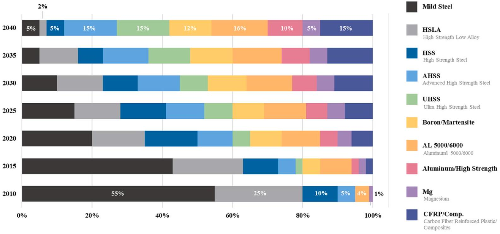
Fig. 1. Material usage in vehicles from 2010 to 2040 [3].

in Fig. 1 [3].
However, the low formability of the aluminium alloys at room temperature significantly limits their applications when forming of complex-shaped components [4-6]. In order to overcome this drawback, Chu et al. [7] proposed a disruptive hydro-forging process, which expanded the horizon of lightweight manufacturing for aluminium tube components. Meanwhile, hot and warm stamping technologies were also developed to enable the forming of aluminium sheet components at elevated temperatures [8-10]. El Fakir et al. [11] investigated how the solution heat treatment, forming and quenching (HFQ) technology could be applied to form AA5754-H111 sheets with a thickness of 1.5 mm. The blank was first heated in a furnace to its solution heat treatment (SHT) temperature of 480 °C at 1 °C/s, followed by a transfer from the furnace to a press machine within 10 s. Subsequently, the cold forming tools deformed the hot blank into the desired shape at 250 mm/s. A different hot stamping process was used in the study of Maeno et al. [12]. Specifically, a 1.3 mm thick AA2025-T4 was heated by electrical resistance to a temperature below its solution heat treatment temperature and subsequently transferred to a press machine within 0.2 s, followed by deformation in cold forming tools. In Fast light Alloys Stamping Technology (FAST), a blank was rapidly heated to an elevated temperature, and then deformed and quenched within cold tools, in order to obtain a desired mechanical strength after a proper artificial ageing process. This approach proved to be effective at reducing the overall cyle time by eliminating a time-consuming solution heat treatment before forming [13,14]. Additionally, components from AA5754, AA6082 and AA7075 were formed in the studies of Cai et al. [15] and Palumbo et al. [16] at various forming temperatures from 200 °C to 500 °C and forming speeds from 75 to 350 mm/s. Different hot and warm aluminium stamping technologies with particular processing parameters were applied to fulfil the structural requirements with special focus on optimising the post-form strength of the formed components.

In order to achieve a high mechanical strength of the formed components, considerable efforts have been made by several researchers to study and optimise the processing parameters in various forming technologies. Maeno et al. [12] proved that the strength of AA2024 could be fully retained when using a fast heating rate of approximately 120 °C/s. However, it decreased with decreasing heating rate, reaching approximately 75\% of that of the as-received material when a slow heating rate of 3 °C/s was used. The solid solution of the aluminium alloy was maintained, and only small clusters were dissolved at a fast heating rate. Hence, its post-form strength increased with increasing heating rate. A similar effect was also described in the research of Zheng et al. [17], in which the effect of forming temperature on the post-form strength of AA7075 was additionally investigated. When the heating rate was not sufficient, the coarse particles precipitated at a growth rate that increased with decreasing forming temperature, thus reducing the post-form strength. Although the SHT temperature activated the precipitates to be dissolved into the aluminium matrix, the subsequent soaking time and quenching rate determined whether a supersaturated solid solution (SSSS) state could be obtained and thus the material strength could be fully retained after artificial ageing. Fan et al. [18,19] found that the post-form strength of 6A02 aluminium alloy increased from 134.7 to 315.6 MPa when the soaking time increased from 5 to 50 min. As a result of a better dissolution of the precipitates into the aluminium matrix at a longer soaking time, the post-form strength of the aluminium alloy was therefore larger. In addition, the post-form strength also increased with increasing quenching rate because of the rapid freeze of the SSSS state. Under the hot stamping conditions, the quenching rate for AA7075 has to achieve 450 °C/s to prevent secondary phase from being precipitated, obtaining a high strength after artificial ageing [20,21].

Currently, the selection and optimisation of decisive processing parameters in hot/warm stamping processes heavily relied on abundant experiments in previous work. Aiming to expedite experimental process development, the present research developed an efficient method to determine the critical processing parameters, i.e. the integration of the finite element (FE) simulated temperature histories with continuous cooling precipitation (CCP) diagrams, which represent the precipitation behaviour of the aluminium alloys as a function of temperature and time [22]. When the critical cooling rate is not exceeded, coarse particles are precipitated in the aluminium grains, leading to a nonhomogenous distribution of the primary precipitates, e.g. Fe, Mn, Cr and Si, thereby decreasing the material strength [23,24]. It was found that the cooling rate of an aluminium alloy is sufficient to fully retain the post-form strength only when its temperature evolution and CCP diagram do not intersect each other [24]. Therefore, a precise FE simulation of the temperature field is of great importance to this method, which requires the implementation of an accurate interfacial heat transfer coefficient (IHTC) as a decisive boundary condition [25-27]. Liu et al. [28,29] subsequently developed an experimentally-verified model to predict the IHTC evolutions for aluminium alloys as a function of contact pressure, surface roughness, tool and lubricant materials. The effects of coating material and initial blank temperature were accounted into the model in their subsequent research [30,31]. However,
the model constants were always aluminium alloy-dependent and thus had to be re-calibrated according to each experimental result.

In the present research, a novel efficient method was developed for identifying the critical processing parameters in hot and warm stamping processes for aluminium alloys. A general aluminium alloyindependent model with one set of fixed constants was first developed to predict the IHTC evolutions as a function of the main governing factors, namely contact pressure, surface roughness, initial blank temperature, initial blank thickness, tool material, coating material and lubricant material. Subsequently, the predicted IHTC evolutions for 6082 and 7075 aluminium alloys were used to simulate their temperature evolutions in FAST forming processes, which were then integrated with the CCP diagrams to identify the critical processing parameters in terms of the desired post-form strength of the aluminium alloys. The method was validated experimentally in the FAST forming of dissimilar alloy blanks joined by Friction Stir Welding. Post-form hardness values were measured to verify the developed IHTC model, the determined critical processing parameters and the overall feasibility of the method described.

## 2. A general aluminium alloy-independent IHTC model

A general heat transfer model was first introduced by Cetinkale and Fishenden [32] as a sum of two parts: (i) the heat transfer across the interfacial air gaps and (ii) the heat transfer enabled by the solid contact between the blank and tooling. Subsequently, their independences of the overall heat transfer were verified by both Rapier et al. [33] and Cooper et al. [34] respectively. Furthermore, the heat transfers across the lubricant and coating layers were also proven as independent contributions to the overall heat transfer, as stated in the studies of Wilson et al. [35] and Antonetti et. al. [36] respectively. In a hot/warm stamping process, the heat transfer between two contacting solids mainly depends on four physical mediums, namely air, metallic solid, lubricant and tool coating. Based on previous research, the general IHTC model was therefore considered as a sum of dominant heat transfer mechanisms as a result of these four mediums, as shown in Eq. (1):

$$
\begin{equation*}
h=h_{a}+h_{s}+h_{l}+h_{c}, \tag{1}
\end{equation*}
$$

where $h_{a}$ is the air-contact IHTC, $h_{s}$ is the solid-contact IHTC, $h_{l}$ is the lubricant-contact IHTC, and $h_{c}$ is the coating-contact IHTC. Due to asperities on two contacting surfaces, a large number of vacancies exist at the interface when a blank contacts forming tools. Consequently, the heat transfer across the air gap becomes the dominant mechanism when the blank is exposed to air before compression by the tools. However, this period is short considering a high stamping speed being applied. Furthermore, the heat transfer across the air gap is relatively negligible when compared to the magnitude of heat transfer induced by the contact pressure, lubricant and/or tool coating when the blank is fully compressed by forming tools. Therefore, the air-contact IHTC $h_{a}$ is of less interest in the present research and thus assumed as a constant value, determined by the previous experimental results at a contact pressure of 0 MPa under dry and uncoated conditions.

When a contact pressure is applied between the blank and forming tools, the heat transfer between the two metallic solids dominates. The factors influencing the interfacial conditions, e.g. initial blank temperature, tool material, surface roughness and contact pressure, also affect the solid-contact IHTC $h_{s}$, which is characterised as Eq. (2):

$$
\begin{equation*}
h_{s}=\alpha \frac{K_{s t}}{R_{s t}} N_{P} L, \tag{2}
\end{equation*}
$$

where $\alpha$ is the temperature dependent thermal diffusivity of the blank, $L$ is a blank thickness dependent parameter, $K_{s t}$ is the equivalent thermal conductivity of the interface between the blank and forming tools, $R_{s t}$ is the equivalent interfacial surface roughness, and $N_{P}$ is a contact pressure dependent parameter. It has been proven that the positive linear effect of initial blank temperature on the IHTC consisted of two factors, i.e. the thermal properties and strength of the aluminium alloy [31]. The IHTC increases with increasing thermal properties of the blank due to its better heat transfer capability at a higher temperature. The positive effect of thermal properties of the blank on the IHTC was identified by the temperature dependent thermal diffusivity $\alpha$ [37], as shown in Eq. (3):

$$
\begin{equation*}
\alpha=B(T) \frac{k_{s}(T)}{\rho(T) c_{p}(T)}, \tag{3}
\end{equation*}
$$

where $B(T)$ is a temperature dependent parameter, $k_{s}(T), \rho(T)$ and $c_{p}(T)$ are the thermal conductivity, density and heat capacity of the aluminium alloy at the target initial blank temperature respectively. Arrhenius equation is widely used to describe the temperature dependence of a reaction rate, which can be either alloy-dependent [38] or -independent [39]. Thus, $B(T)$ is modelled by Eq. (4) using the Arrhenius equation.

$$
\begin{equation*}
B(T)=b_{0} \exp \left(\frac{Q_{b}}{R T}\right), \tag{4}
\end{equation*}
$$

where $R$ is the molar gas constant, $T$ is the absolute temperature, $b_{0}$ and $Q_{b}$ are model constants. Therefore, the temperature dependent thermal diffusivity $\alpha$ is able to characterise the rate of heat transfer at different initial blank temperatures. The effect of material strength of the aluminium blank on the IHTC was integrated into $N_{P}$, as shown in Eq. (5):

$$
\begin{equation*}
N_{P}=1-\exp \left(-\lambda f \frac{P}{\sigma_{U}}\right), \tag{5}
\end{equation*}
$$

where $\lambda$ is a model constant, $f$ is a tempering correction factor, $P$ is the applied pressure, and $\sigma_{U}$ is the temperature dependent ultimate strength of the blank. Due to the asperities on the contacting surfaces, the real contact area at the interface is less than the apparent value before compression. When an aluminium blank is heated to elevated temperatures, its strength is much lower than that of the steel tools at room temperature. Consequently, the asperities on the blank contact surface are deformed by the forming tools at a defined contact pressure during compression, leading to the increased real contact area and IHTC. When the applied pressure reaches its convergent value, the real contact area approaches its apparent value, leading to the peak IHTC. It was found that the real contact area divides by its apparent value is equivalent to the applied pressure divides by the ultimate strength of the aluminium blank [40]. Meanwhile, a logarithmical increasing trend of the real contact area with pressure was identified [41,42]. Therefore, $N_{P}$ and thus $h_{s}$ are supposed to logarithmically increase with increasing ratio of $P$ to $\sigma_{U}$.

As mentioned before, the aluminium strength is the other functional factor on the effect of initial blank temperature on the IHTC, and it decreases with increasing temperature. As a result, more asperities on the blank contact surface are deformed at a higher initial blank temperature, leading to the increased real contact area and IHTC. Hence, the material strength of the blank negatively influences the IHTC, and its temperature dependence was modelled as Eq. (6) using the Arrhenius equation [43].

$$
\begin{equation*}
\sigma_{U}=\sigma_{0} \exp \left(\frac{Q_{\sigma}}{R T}\right), \tag{6}
\end{equation*}
$$

where $\sigma_{0}$ and $Q_{\sigma}$ are model constants, identified by the high-temperature uniaxial tensile tests. The ultimate strength of the material greatly depends on tempering. The tempering correction factor $f$ is therefore applied to enable $N_{P}$ to predict the deformation of different tempered alloys, as shown in Eq. (7), where $\sigma_{U}(T x)$ and $\sigma_{U}(T 6)$ are the ultimate strength of the aluminium alloy under the present tempering conditions and the T6 conditions respectively.

$$
\begin{equation*}
f=\frac{\sigma_{U}(T x)}{\sigma_{U}(T 6)}, \tag{7}
\end{equation*}
$$

The amount of heat transfer increases with increasing thermal conductivities of the two contacting solids, leading to the increased IHTC. The equivalent thermal conductivity of the interface between the blank and forming tools $K_{s t}$ was therefore applied to describe the capability of the interface to conduct heat, as shown in Eq. (8):

$$
\begin{equation*}
K_{s t}=\frac{2}{k_{s}^{-1}+k_{t}^{-1}}, \tag{8}
\end{equation*}
$$

where $k_{s}$ and $k_{t}$ are the thermal conductivities of the aluminium blank (specimen) and forming tools at their initial (forming) temperatures. In contrast, the IHTC decreases with increasing surface roughness because of the reduced real contact area between the blank and forming tools [44]. The negative influence of surface roughness was modelled as Eq. (9):

$$
\begin{equation*}
R_{s t}=\sin \theta \sqrt{R_{s}^{2}+R_{t}^{2}}, \tag{9}
\end{equation*}
$$

where $R_{s}$ and $R_{t}$ are the average (mean) surface roughness of the aluminium blank (specimen) and forming tools respectively before compression, generally describing the height variations in the contact surfaces. The root mean squared value was used to describe the roughness condition at the interface. Additionally, $\theta$ is the initial deformation angle of the blank contact profile, and thus $\sin \theta$ describes the mean modulus of the slope of the blank contact profile [34,45]. The deformation of the blank by the forming tools has two forms. When $R_{s}$ is smaller than $R_{t}$, the forming tools coarsen the surface profile of the blank to increasingly mesh the contacting surfaces, thus leading to a larger real contact area; when $R_{s}$ is larger than $R_{t}$, the forming tools smoothen the surface profile of the blank, resulting in a similar consequence, i.e. a larger real contact area. However, the initial deformation angle $\theta$ is different under these two forms, which is assumed as 20° when $R_{s}$ is smaller than $R_{t}$, and 70° when $R_{s}$ is larger than $R_{t}$. Therefore, the interfacial surface roughness $R_{s t}$ represents the initial roughness and deformation conditions at the interface.

In the hot/warm stamping industry, blanks with different thicknesses are applied to satisfy the desired requirements. Although the interfacial conditions are independent of the blank thickness, a thicker blank will be capable of absorbing and storing a higher internal thermal energy, which could compensate for the heat loss at the interface. Therefore, an engineering IHTC able to define the effect of blank thickness can be used in the FE model to accurately simulate the temperature field, while the true IHTC is not changed. The blank thickness parameter $L$ is able to describe its positive effect on the IHTC and modelled as Eq. (10), where $l$ is the blank thickness, $m$ and $n$ are model constants.

$$
\begin{equation*}
L=m \ln (l)+n, \tag{10}
\end{equation*}
$$

Lubricants are widely used in the hot/warm stamping processes to increase the drawability of the blank material, as well as decreasing the wear of the forming tools. Due to its importance, the lubricant-contact IHTC $h_{l}$ was developed as Eq. (11):

$$
\begin{equation*}
h_{l}=\omega \frac{K_{s l t}}{R_{s t}} N_{\delta}, \tag{11}
\end{equation*}
$$

where $\omega$ is a model constant, $K_{\text {slt }}$ is the equivalent mean thermal conductivity of the interface between the blank, forming tools and lubricant, and $N_{\delta}$ is a lubricant thickness dependent parameter.

$$
\begin{equation*}
K_{s l t}=\frac{3}{k_{s}^{-1}+k_{l}^{-1}+k_{t}^{-1}}, \tag{12}
\end{equation*}
$$

where $k_{l}$ is the thermal conductivity of the lubricant. When a lubricant is used at the interface as a heat transfer medium, the vacancies between the blank and forming tools are filled by the lubricant, instead of air. Therefore, the equivalent thermal conductivity of the interface between the blank, forming tools and lubricant $K_{\text {slt }}$ is more accurate to define the capability of the interface to conduct heat under the lubricated conditions. Meanwhile, the surface roughness conditions at the interface are not changed by the application of the lubricant, and thus the interfacial surface roughness $R_{s t}$ is maintained.

Furthermore, the IHTC increases with increasing lubricant layer thickness, as a result of more vacancies at the interface being filled by the lubricant to enhance the heat transfer. However, when the lubricant thickness achieves a convergent value, the vacancies are fully filled, and the redundant lubricant is squeezed out of the contact surfaces. Consequently, the further increasing lubricant thickness no longer has an effect on the IHTC. Therefore, $N_{\delta}$ and thus $h_{l}$ have a logarithmical increasing relationship with the lubricant layer thickness $\delta_{l}$, as shown in Eq. (13).

$$
\begin{equation*}
N_{\delta}=1-\exp \left(-\gamma \delta_{l}\right), \tag{13}
\end{equation*}
$$

where $\gamma$ is a model parameter. Coatings have been widely used in the hot/warm stamping processes for improving the resistance to oxidation, corrosion and wear resistance. Differently from a lubricant being applied as an independent heat transfer medium, a tool coating is stably deposited onto the contact surfaces of the forming tools. Therefore, the heat transfer mechanism on the lubricant-contact IHTC $h_{l}$ is different from that on the coating-contact IHTC $h_{c}$, which was modelled as Eq. (14):

$$
\begin{equation*}
h_{c}=\beta \frac{k_{s}}{A} \tan \theta \cdot \ln \left(k_{c} / k_{l}\right) \delta_{c} \cdot N_{P}, \tag{14}
\end{equation*}
$$

where $\beta$ is a model parameter, $k_{c}$ is the thermal conductivity of the tool coating, $\delta_{c}$ is the layer thickness of the tool coating, and $A$ is the apparent contact area between the blank and forming tools. Because heat transfers from the hot blank to the cold coated tools across the contact area, the coating-contact IHTC $h_{c}$ is determined by three terms. The first term of $k_{s} \tan \theta / A$ represents the thermal energy at the high potential (hot blank), the second term of $\ln \left(k_{c} / k_{l}\right) \delta_{c}$ represents the thermal energy at the low potential (cold coated tools), and the third term $N_{P}$ determines the pressure dependent driving force from the high to low potential. Furthermore, the second term $\ln \left(k_{c} / k_{l}\right) \delta_{c}$ describes the thermal performance of the tool coating and the integrated effects of coated tools on the IHTC. A positive term value indicates that the applied tool coating has a higher thermal conductivity than that of the substrate, contributing to a larger IHTC value; while a negative term value indicates that the applied tool coating has a lower thermal conductivity than that of the substrate, contributing to a smaller IHTC value. The effect of tool coating on the IHTC, either positive or negative, increases with increasing absolute value of this term. Therefore, the second term $\ln \left(k_{c} / k_{l}\right) \delta_{c}$ indicates that the thermal conductivity and layer thickness of the applied tool coating determine its effect on the IHTC.

Therefore, Eqs. (1)-(14) comprise the general model to predict IHTC evolutions for different aluminium alloys with contact pressure, initial blank temperature, initial blank thickness, tool material, surface roughness, lubricant and tool coating. Instead of determining new IHTC results, the present research applied the experimentally verified IHTC results in the authors' previous research [28-31] to calibrate the alloyindependent model constants, as shown in Table 1, which were optimised by Genetic Algorithm as shown in Fig. 2. In addition to these 10 model constants, the other 16 material parameters, e.g. thermal conductivity, surface roughness and lubricant/coating layer thickness, require actual measurements to be assigned in the model, which are

Table 1
The IHTC model constants.
| Parameter | $b_{0}\left(\mathrm{~s} / \mathrm{m}^{2}\right)$ | $Q_{b}(\mathrm{~J} / \mathrm{mol})$ | $R(\mathrm{~J} / \mathrm{molK})$ | $\lambda(-)$ | $m(-)$ |
| :--- | :--- | :--- | :--- | :--- | :--- |
| Value | 1.69 | -1730 | 8.314 | 5 | 0.64 |
| Parameter | $n(-)$ | $\omega(-)$ | $\gamma\left(\mathrm{m}^{-1}\right)$ | $\beta(-)$ | $A\left(\mathrm{~m}^{2}\right)$ |
| Value | 0.56 | 4.2e-5 | 1.5 e 5 | 8.3e3 | 5e-4 |

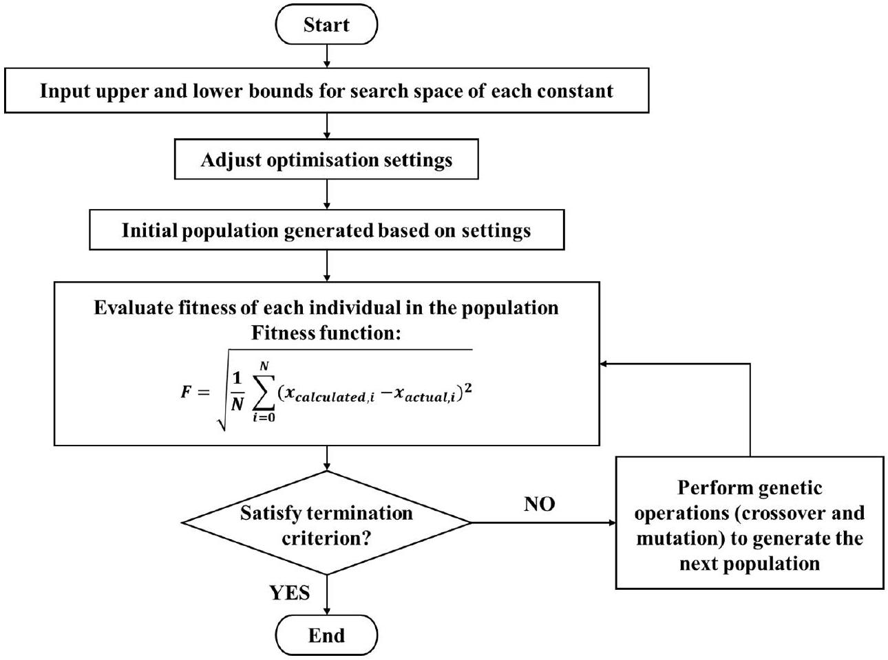
Fig. 2. The flow chart of Genetic Algorithm to optimise the model constants.

shown in Table 2. The characterisation of the alloy-independent model constants significantly simplifies the model and enhances its flexibility for different aluminium alloys.

Fig. 3 shows the comparison between the experimentally verified IHTC results under different conditions determined in the previous research [28-31] and the IHTC evolutions predicted by the developed model using the actual measured parameters in those research. In order to demonstrate the comprehensive capability of the developed IHTC model, the representative experimentally-verified IHTC results were selected, and the corresponding actual material conditions, e.g. thickness, surface roughness, temperature and tool material, were also shown in the figure. Specifically, Fig. 3 (a) shows the IHTC for AA6082 with different thicknesses at different contact pressures to demonstrate the effects of blank thickness and contact pressure on the IHTC [28], Fig. 3 (b) shows the IHTC for AA6082 under the dry and lubricated conditions to demonstrate the effect of lubricant on the IHTC [28], Fig. 3 (c) shows the IHTC between AA7075 and steel tool with different coatings to demonstrate the effect of tool coating on the IHTC [30], while Fig. 3 (d) shows the IHTC for AA7075 at different initial temperatures to demonstrate the effect of initial blank temperature on the IHTC [31]. Meanwhile, the IHTCs between two different aluminium alloys and four different tool materials were also shown in this figure, demonstrating the effects of blank and tool materials on the IHTC. The excellent agreements between the experimental and predicted IHTC results suggest a high accuracy of the developed model.

As shown in Fig. 3, the IHTC evolutions were always given as a function of contact pressure to cooperate with their implementation in the commercial FE software. In order to highlight the effects of other influential factors, the IHTC evolutions were predicted by the developed model as a function of the initial blank temperature shown in Fig. 4 (a), the initial blank thickness shown in Fig. 4 (b), the thermal conductivity of tools shown in Fig. 4 (c) and the thermal conductivity of coatings shown in Fig. 4 (d). The material conditions shown in Fig. 4, e.g. thickness, surface roughness, temperature and tool material, were identical to those applied in the actual experiments shown in Fig. 3.

## 3. Critical processing parameters in hot/warm stamping processes

As previously mentioned, the predicted IHTC evolution can be implemented in the FE models of hot/ warm stamping processes to simulate the temperature evolutions of the aluminium alloys, which are then compared with the CCP diagrams to identify whether the critical cooling rate and IHTC are reached. Therefore, the critical processing parameters can be optimised to meet the desired requirements through the integration of the FE simulations with the CCP diagrams. The present research identified the critical contact pressures for 6082 and 7075 aluminium alloys under the FAST forming conditions. The same method can be applied to determine other processing parameters, e.g. forming temperature, heating rate and soaking time [46].

Table 2
The thermal conductivity, surface roughness and thickness of the materials.
| Materials | AA6082 [28] | AA7075 [29] | H13 [29] | P20 [29] | G3500 [29] | D6510 [31] |
| :--- | :--- | :--- | :--- | :--- | :--- | :--- |
| Thermal conductivity ( $\mathrm{W} / \mathrm{mK}$ ) | 170 | 140 | 24.4 | 31.5 | 44 | 35.2 |
| Surface roughness (nm) | 430 | 340 | 980 | 960 | 810 | 180 |
| Materials | CrN [30] | TiN [30] | WC-Co [31] | Graphite lubricant [28] |  |  |
| Thermal conductivity ( $\mathrm{kW} / \mathrm{mK}$ ) | 12 | 19 | 29.2 | 24 |  |  |
| Thickness ( $\mu \mathrm{m}$ ) | 6 | 8 | 2 | - |  |  |

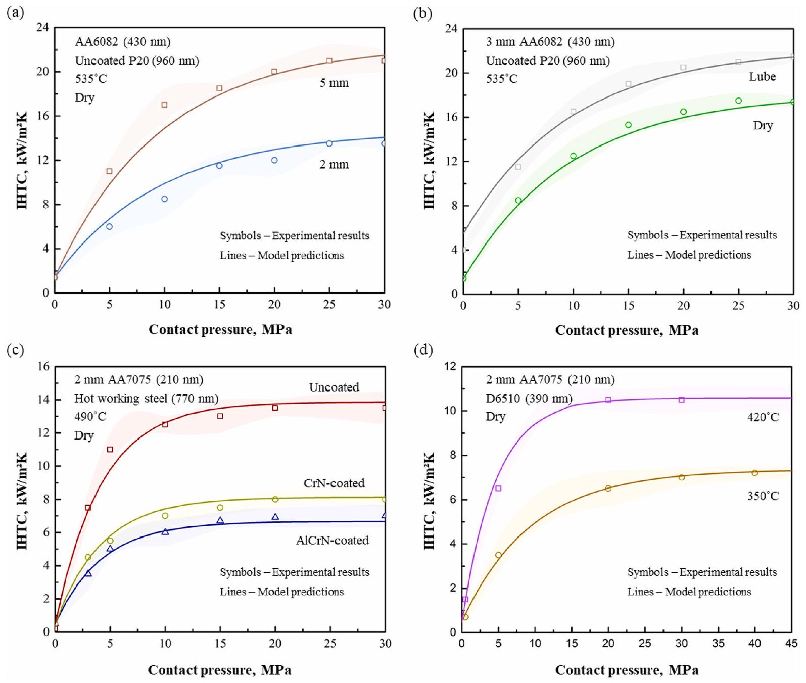
Fig. 3. The comparisons between the experimental and predicted IHTC results for (a) AA6082 with 2 and 5 mm thicknesses under dry conditions at 535 °C when using uncoated P20 tools [28]; (b) AA6082 with 3 mm thickness under lubricated and dry conditions at 535 °C when using uncoated P20 tools [28]; (c) AA7075 with 2 mm thickness under dry conditions at 490 °C when using uncoated, CrN and AlCrN-coated tools [30]; and (d) AA7075 with 2 mm thickness under dry conditions at 420 °C and 350 °C when using WC-coated tools [31].

### 3.1. FE simulation setup to identify the critical contact pressure

In order to characterise the critical contact pressure in the FAST forming of the aluminium alloys, a FE model was developed in PAM-STAMP software to simulate the heat transfer between an aluminium blank at an elevated temperature and tools at room temperature. This model was composed of seven components; an aluminium blank, two symmetrical blankholders, two symmetrical screws and a symmetrical punch and die pair, of which the geometries were identical to those in the dedicated heat transfer test facility, precisely representing the heat transfer test, as shown in Fig. 5 (a) [30]. It has been proven that a mesh size of $2 \times 2 \mathrm{~mm}^{2}$ would ensure accurate simulations while providing reasonable computational times by the mesh sensitivity analysis in the authors' previous research [31]. Thermal shell elements with a size of $2 \times 2 \mathrm{~mm}^{2}$ were therefore used to mesh the forming tools and blankholders, while the elements with a smaller size of $1 \times 1 \mathrm{~mm}^{2}$ were used to mesh the Al blank, in order to demonstrate a finer quenching distribution in Section 3.2. Due to their irregular basements, the punch and die had to be imported to the FE model as rigid bodies that only their surfaces were meshed by the thermal shell elements. The temperature gradient along the thickness direction of a sheet blank is negligible in a hot/warm stamping process [47]. Therefore, the number of the integration point through the Al blank thickness was automatically defined as three in the FE model. Due to the heating process being not simulated, the initial temperatures for the aluminium blank and other components had to be assigned as the target heating/ forming temperature and room temperature respectively. In addition, all six degrees of freedom for the aluminium blank were defined as free, those for the die were restricted, and only freedom in the z-direction was free for the punch, blankholders and screws.

A 'hot forming validation double action' strategy was used in the FE model, in which the aluminium blank was first freely located onto the two blankholders and then compressed by the two screws at a pre-defined load/pressure, which was a variable to be identified in this research. Subsequently, the punch moved towards the blank along the moving direction (z-direction) at a speed of 100 mm/s and compressed it against the die at a load/pressure the same as the blankholding force for 10 s. The temperature evolutions of the blank during compression was measured and exported. In order to characterise the critical pressure, the IHTC curve was implemented in the FE simulation, defined as a function of pressure with the restriction of other processing parameters, e.g. heating temperature (initial blank temperature) and tool materials. Therefore, the heat transfer from the hot aluminium blank to cold forming tools occurred at the IHTC value corresponding to the predefined contact pressure. In the present research, when a P20 steel was used as forming tools, the IHTCs for AA6082 and AA7075 under the

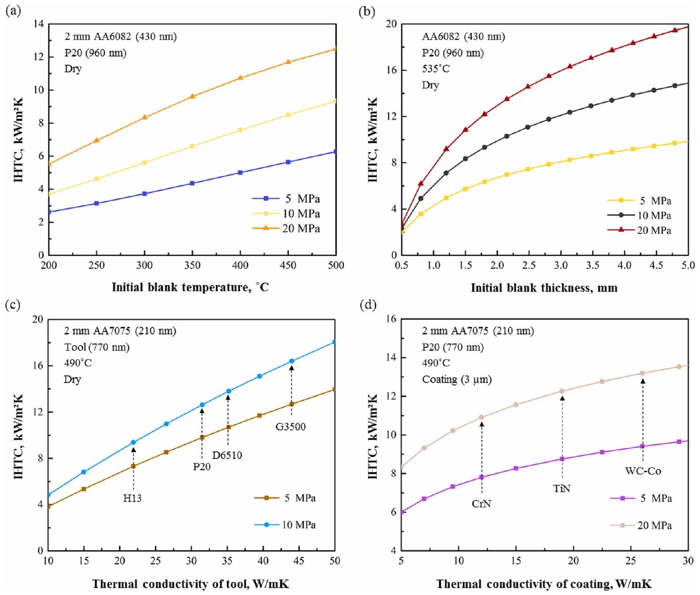
Fig. 4. The predicted IHTC evolutions as a function of (a) initial blank temperature; (b) initial blank thickness; (c) thermal conductivity of tool; and (d) thermal conductivity of coating.

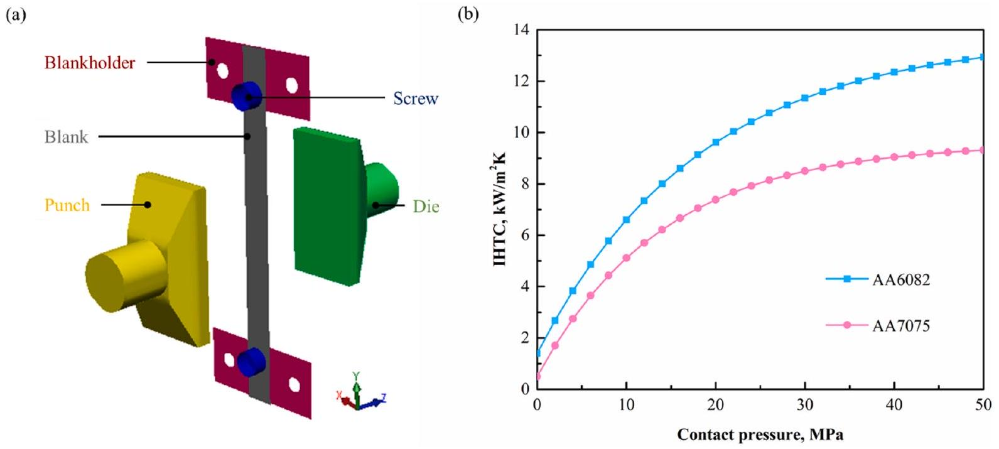
Fig. 5. (a) The FE model in PAM-STAMP to determine the critical processing parameters; (b) The predicted IHTC evolutions for the AA6082 and AA7075 as a function of contact pressure under the FAST forming conditions.

Table 3
The material properties defined in the FE model.
| Materials | AA6082 [28] | AA7075 [29] | P20 [28] |
| :--- | :--- | :--- | :--- |
| Young's modulus (GPa) | 70 | 140 | 205 |
| Yield strength (MPa) | 250 | 420 | 840 |
| Density $\left(\mathrm{kg} / \mathrm{m}^{3}\right)$ | 2700 | 2707 | 7850 |
| Thermal conductivity ( $\mathrm{W} / \mathrm{mK}$ ) | 170 | 140 | 31.5 |
| Specific heat capacity (J/kgK) | 890 | 1060 | 473 |

FAST forming conditions were predicted and implemented in the FE model, as shown in Fig. 5 (b). The material viscoplastic models for AA6082 [48] and AA7075 [49] were implemented in the FE model, while the material properties defined in the FE model were shown in Table 3.

The developed FE model enables symmetrical heat transfer from the hot blank to cold tools as well as the homogeneous distribution of the load/pressure on the contact area of the aluminium blank. In addition to contact pressure, other processing parameters were also allowed to be assigned in the FE model to reveal their effects on the temperature evolutions of the blank, in order to determine their critical values.

### 3.2. Integration of the FE simulated results with the CCP diagrams

After the FE simulations, the temperature evolutions of all elements on the aluminium blank were exported and then compared with the CCP diagrams for 6082 and 7075 aluminium alloys, which were characterised in the studies of Milkereit et al. [50,51]. A filter was then applied to distinguish 'safe' elements from the entire aluminium blank. Elements, for which their temperature evolutions did not intersect the CCP diagram were defined as 'safe' elements shown in green as their post-form strength can be fully retained; otherwise, they were defined as 'fail' elements shown in red. It has been proven that the IHTC and cooling rate of the aluminium alloy increase with increasing pressure, consequently leading to an increased number of 'safe' elements. Regarding the contact area on the AA6082 blank, all elements were 'safe' when the contact pressure was larger than 18 MPa , as demonstrated in Fig. 6 (a). This indicated that the critical contact pressure for 6082 aluminium alloy is 18 MPa under the FAST forming conditions.

Similarly, different contact pressures were applied in the FE simulation to identify the critical value for AA7075. The number of 'safe' elements increased with increasing pressure as well. Until the achievement of 28 MPa, all elements on the contact area of the aluminium blank were 'safe', as shown in Fig. 6 (b). This indicated that the critical contact pressure for 7075 aluminium alloy is 28 MPa under the same conditions, which is larger than that for 6082 aluminium alloy. The identification of the critical contact pressures for different aluminium alloys is of great importance to not only ensure that the post-form strength of the materials can be fully retained but also prevent the excessive contact pressure from being applied. It should be noticed that the critical pressure would change in different forming processes. Under some particular conditions, the critical cooling rate of the aluminium alloys may not be reached, regardless of the contact pressure applied. In this case, the application of lubricants and tools with higher thermal conductivities should be considered as potential solutions. Therefore, the critical processing parameters have to be particularly characterised according to the applied forming processing windows.

## 4. Experimental validation of the critical contact pressures

### 4.1. FSW of dissimilar alloy blanks

The dissimilar alloy blanks were produced by FSW AA6082 and AA7075 sheets with a thickness of 2 mm, which were supplied by Smiths Metal Centres Limited. The FSW technology was deployed using an AWEA LP 4025Z FSW machine based at TWI Ltd in Cambridge. Fig. 7 shows the FSW blank geometry, measuring 600 mm long and 300 mm wide. The FSW tool used combined a concave shoulder of a 15 mm diameter with a Triflute ${ }^{\mathrm{TM}}$ probe of a 5 mm diameter. The tool was tilted at 2°, plunged into the material at the joint starting location using a rotation speed of 17 rev/s. A dwell time of 1 s was employed once the probe reached its target penetration depth, subsequently initiating the travel motion at 12 mm/s. The weld cycle was conducted entirely on position control. The welding procedure was selected based on prior experience at TWI Ltd. FSW blank design and sample extraction was based on ISO 25239-1:2011.

### 4.2. FAST forming of panel components

Cross weld samples 90 mm long and 10 mm wide were extracted from the dissimilar alloy blanks to form M-shaped panel components under the FAST forming conditions, and their post-form hardness was subsequently measured to verify the determined critical contact pressures for both aluminium alloys. As shown in Fig. 8 (a), a dedicated forming facility was equipped with the M-shaped forming tools and then assembled in a Gleeble 3800 thermal-mechanical test machine to perform the FAST forming processes. Due to its precise automatic control, this forming facility is beneficial for accurate validation of the processing parameters under different conditions.

A dissimilar alloy blank was screwed onto the blankholders for each test. A cold forming process at room temperature was first conducted, resulting in a brittle fractured in the AA7075 parent material, as demonstrated in Fig. 8 (b). This could be expected due to the lower ductility of AA7075 compared to that of AA6082. A second dissimilar aluminium alloy was deformed under the FAST forming conditions, envisaging to increase the formability while preserving its post-form strength of the material. A blank was rapidly heated to the target temperature. Subsequently, the cold punch was activated to move along the guide pillars towards the cold die and deform the blank into an Mshaped panel component, as demonstrated in Fig. 8 (c), followed by quenching of the component to room temperature at different pressures of 10, 18 and 28 MPa. Meanwhile, the other processing parameters were set as the same as those used in previous FE simulation. After appropriate artificial ageing processes were undertaken, the post-form hardness of the components formed at the three different contact pressures was measured by a Zwick ZHU hardness tester.

As shown in Fig. 9, the hardness values of the as-received AA7075 and AA6082 were 181 and 121 HV respectively. The hardness profile across the weld region exhibited a gradient between these two nominal values. This is consistent with the mixing of the dissimilar aluminium alloys in the welding zone. The target was to achieve at least 95\% of the parent material original strength following forming and artificial ageing. When the contact pressure was 10 MPa, the post-form hardness of the AA7075 was approximately 164 HV, which was 9.4\% lower than that of the as-received material, while the post-form hardness of the AA6082 was approximately 103 HV with a 14.9\% loss in its as-received value. The insufficient post-form hardness of both AA6082 and AA7075 was due to the critical contact pressure being not reached. Increasing to the contact pressure to 18 MPa proved to fulfil the critical value for the AA6082 only. As a result, the post-form hardness of the AA6082 reached 97\% of its as-received hardness, while that of the AA7075 did not meet the target yet. When the contact pressure was 28 MPa, the post-form hardness of both AA6082 and AA7075 were equivalent to that of the parent material conditions, reaching 120 and 179 HV respectively. The experimental observations agreed well with the previous deduction, i.e. the post-form hardness/strength of the material can be fully retained only when its critical contact pressure is achieved.

### 4.3. FE simulation of FAST forming of dissimilar alloy FSW blanks

Meanwhile, the FE simulation of the FAST forming of the dissimilar alloys was performed in PAM-STAMP to predict the 'safe/fail'

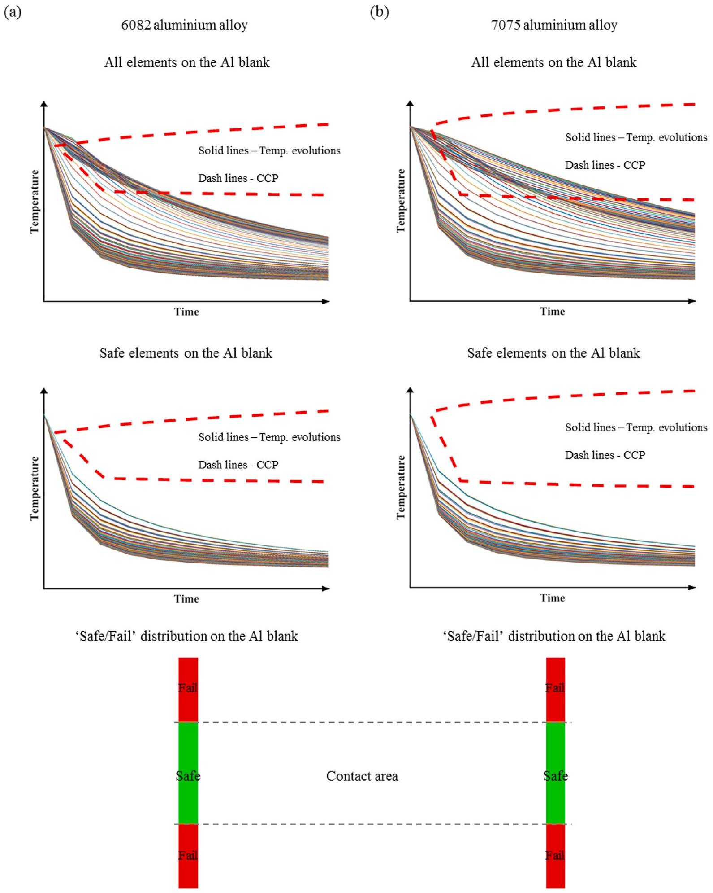
Fig. 6. The temperature evolutions of all elements, the temperature evolutions of the 'safe' elements, after filtering, and the distributions of 'safe/fail' elements on (a) the AA6082 blank at the critical pressure of 18 MPa; and (b) the AA7075 blank at the critical pressure of 28 MPa.

distribution on the formed component under different contact pressure conditions. The FE model composed of three components, i.e. a blank made from the dissimilar aluminium alloys, a punch and die made from the P20 tool steel, of which geometries were identical to those used in the experiments, as shown in Fig. 10. Similar to previous FE simulation identifying the processing parameters, the same quadrangle thermal shell elements with sizes of $1 \times 1 \mathrm{~mm}^{2}$ and $2 \times 2 \mathrm{~mm}^{2}$ were used for the blank and forming tools respectively. Additionally, the definition of freedom of degrees for all components and the simulation strategy were identical to previous simulations, i.e. the hot blank C was freely located onto the cold die, and the cold punch instantly moved along the zdirection at a speed of 100 mm/s to deform the blank into an M-shaped component, followed by quenching at pressures of 10, 18 and 28 MPa respectively for 10 s. The friction coefficients for AA6082 and AA7075 were defined as 0.15 [52] and 0.3 [47] respectively. The heat transfer from the hot blank to cold forming tools occurred at the IHTC evolution

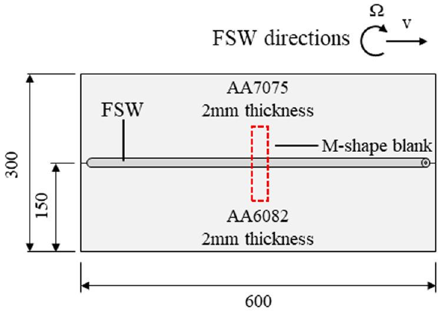
Fig. 7. Dimensions (in mm) of the FSW sheet.

being assigned. Subsequently, the temperature evolutions of the blank were exported and then compared with the CCP diagrams.

After filtering, the 'safe/fail' distributions on the M-shaped component under different contact pressure conditions were shown in Fig. 11. Similarly, the 'safe' elements were shown as green colour, while the 'fail' elements were shown as red colour. Meanwhile, the shades of red colour represent the level of 'fail'. Due to the insufficient contact on the side vertical walls of the blank, their post-form strength was not able to achieve a high value under the applied forming conditions. Coincident with the experimental results, the entire blank was failed to achieve a high post-form strength at 10 MPa, while only the AA6082 part was 'safe' when the pressure increased to 18 MPa. Apart from the vertical walls, the rest of the blank was 'safe', fully retaining the material strength for a forming pressure of 28 MPa. Both the experimental and simulated results verified that the critical pressures for AA6082 and AA7075 are 18 and 28 MPa respectively under the FAST forming conditions. Therefore, the developed method could enable the accurate identification of the processing parameters under different forming conditions. Furthermore, the FE simulation of forming processes can be first conducted to optimise the tool design to eliminate insufficient contact in particular areas, e.g. side walls and corners, ensuring that

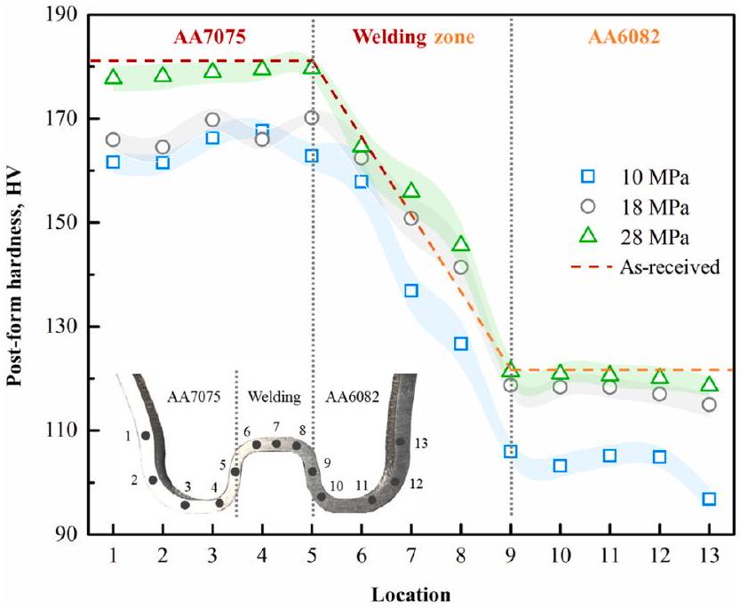
Fig. 9. The hardness distributions on the M-shaped components at different pressures.

high cooling rate and material strength can be achieved after a proper artificial ageing process.

## 5. Conclusion

The present research developed a novel efficient method for identifying the critical processing parameters in hot and warm stamping processes for aluminium alloys. A general aluminium alloy-independent model was first developed to predict the IHTC evolutions as a function of contact pressure, surface roughness, initial blank temperature, initial blank thickness, tool material, coating material and lubricant material, using one set of fixed model constants. Through the integration of the temperature evolutions predicted by the IHTC model with the CCP diagrams, the critical contact pressures of 18 MPa for AA6082 and 28 MPa for AA7075 were characterised under the FAST forming conditions.

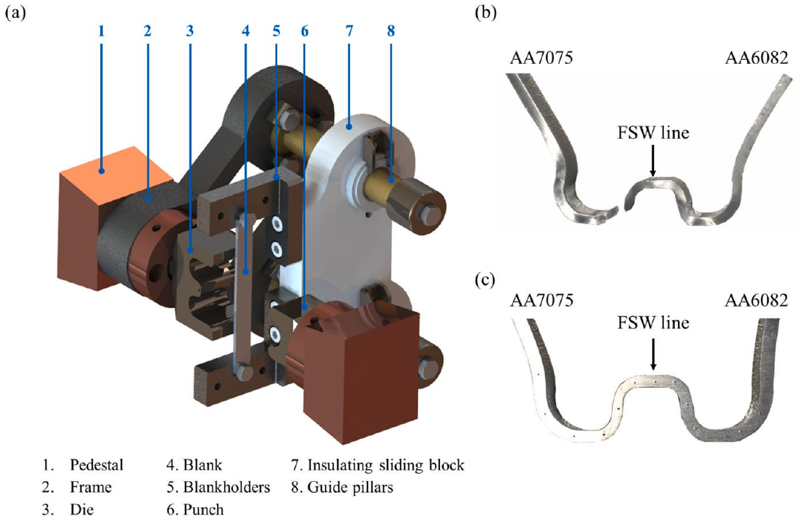
Fig. 8. (a) The forming test facility; (b) A M-shaped component formed at room temperature; (c) A M-shaped component formed under the FAST forming conditions.

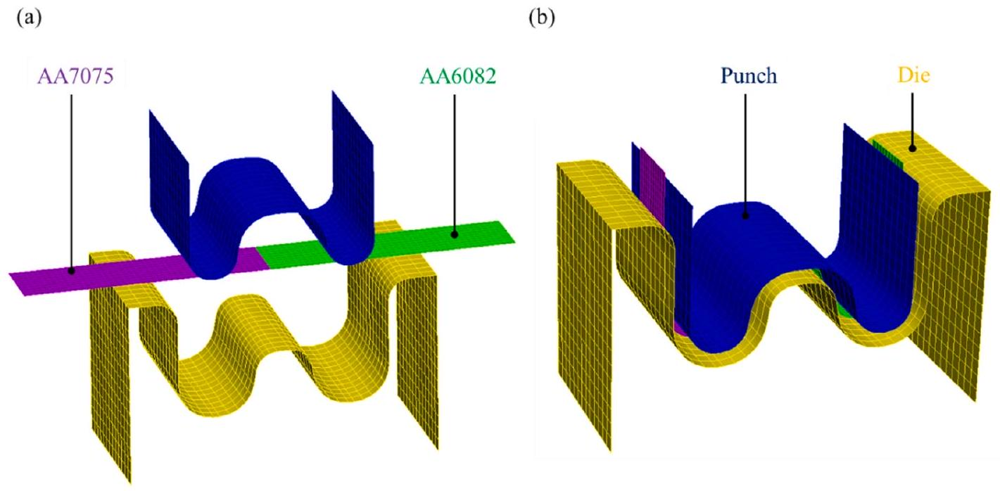
Fig. 10. The FE model of a forming process under (a) unloading; and (b) loading conditions.

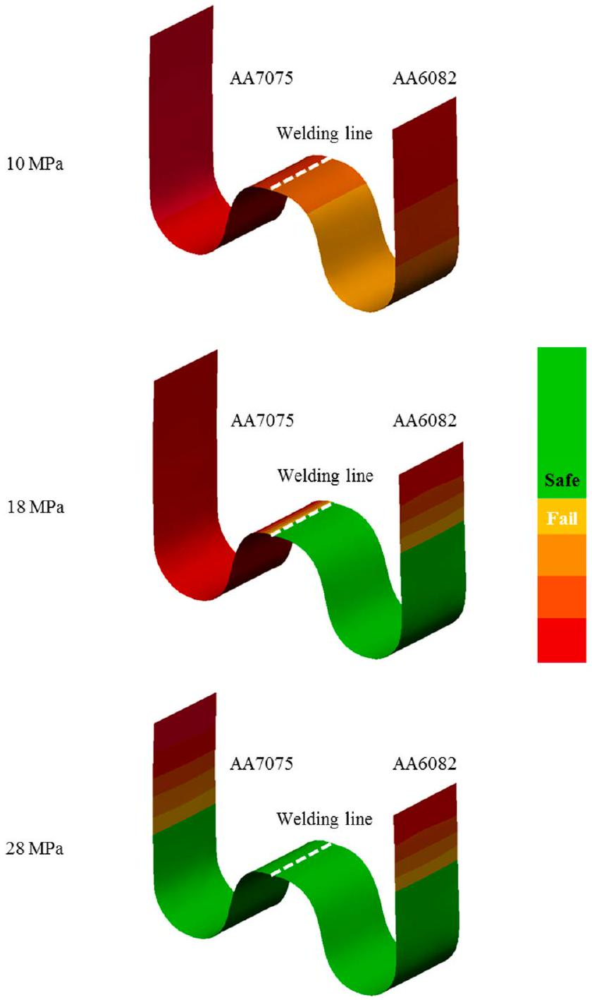
Fig. 11. The 'safe/fail' distributions on the M-shaped component made from dissimilar aluminium alloys at different contact pressures of 10, 18 and 28 MPa.

Subsequently, FSW joining AA6082 and AA7075 were formed into M-shaped panel components at different contact pressures under the FAST forming conditions. The post-form hardness of the dissimilar FSW blanks achieved approximately 97\% of the parent material original hardness at the identified critical contact pressure. Meanwhile, the FE simulation of the FAST forming of the dissimilar alloys was conducted to predict whether the post-form strength of the formed components was reached or not at different contact pressures, verifying the accuracy of the identified critical contact pressures and developed general IHTC model as well as the feasibility of the described method. The key findings were summarised below:

(1) In addition to the critical contact pressure in the FAST forming, the described efficient method is able to characterise other critical processing parameters in different hot and warm stamping processes for aluminium alloys, dramatically saving the experimental efforts.
(2) The developed general aluminium alloy-independent IHTC model is capable of predicting the temperature evolutions under the desired forming conditions.
(3) Dissimilar FSW blanks joining AA6082 and AA7075 could be formed using FAST forming, allowing to restore 95\% of the original parent material hardness.

## Declaration of Competing Interest

None declared.

## Acknowledgement

The strong support from the Institute of Automation, Heilongjiang Academy of Sciences, for this funded research is much appreciated.

## References

[1] A. Smallbone, B. Jia, P. Atkins, A.P. Roskilly, The impact of disruptive powertrain technologies on energy consumption and carbon dioxide emissions from heavy-duty vehicles, Energy Convers. Manag. X. 6 (2020) 100030, , https://doi.org/10.1016/j. ecmx.2020.100030.
[2] C. Ungureanu, S. Das, I.S. Jawahir, Life-cycle cost analysis: aluminum versus steel in passenger cars, Miner. Met. Mater. Soc. (2007) 11-24.
[3] S. Brett, A. Spulber, S. Modi, T. Fiorelli, Technology roadmaps: Intelligent mobility technology, materials and manufacturing processes, and light duty vehicle propulsion, Cent. Automot. Res. (2017), https://doi.org/10.1177/1060028017712725.
[4] X. Fan, Z. He, K. Zheng, S. Yuan, Strengthening behavior of Al-Cu-Mg alloy sheet in hot forming-quenching integrated process with cold-hot dies, Mater. Des. 83 (2015)

557-565, https://doi.org/10.1016/j.matdes.2015.06.058.

[5] Y. Cai, X. Wang, S. Yuan, Analysis of surface roughening behavior of 6063 aluminum alloy by tensile testing of a trapezoidal uniaxial specimen, Mater. Sci. Eng. A. 672 (2016) 184-193, https://doi.org/10.1016/j.msea.2016.07.008.
[6] J.N. Rasera, K.J. Daun, C.J. Shi, M. D'Souza, Direct contact heating for hot forming die quenching, Appl. Therm. Eng. 98 (2016) 1165-1173, https://doi.org/10.1016/j.applthermaleng.2015.12.142.
[7] G.N. Chu, G. Chen, Y.L. Lin, S.J. Yuan, Tube hydro-forging - a method to manufacture hollow component with varied cross-section perimeters, J. Mater. Process. Technol. 265 (2019) 150-157, https://doi.org/10.1016/j.jmatprotec.2017.11.007.
[8] S. Toros, F. Ozturk, I. Kacar, Review of warm forming of aluminum-magnesium alloys, J. Mater. Process. Technol. 207 (2008) 1-12, https://doi.org/10.1016/j.jmatprotec.2008.03.057.
[9] H. Karbasian, A.E. Tekkaya, A review on hot stamping, J. Mater. Process. Technol. 210 (2010) 2103-2118, https://doi.org/10.1016/j.jmatprotec.2010.07.019.
[10] W. Ma, B. Wang, L. Yang, X. Tang, W. Xiao, J. Zhou, Influence of solution heat treatment on mechanical response and fracture behaviour of aluminium alloy sheets: An experimental study, Mater. Des. 88 (2015) 1119-1126, https://doi.org/10.1016/j.matdes.2015.09.044.
[11] O. El Fakir, L. Wang, D. Balint, J.P. Dear, J. Lin, T.A. Dean, Experimental and numerical studies of the solution heat treatment, forming, and in-die quenching (HFQ) process on AA5754, Int. J. Mach. Tools Manuf. 87 (2014) 39-48, https://doi.org/10.1016/j.ijmachtools.2014.07.008.
[12] T. Maeno, K. Mori, R. Yachi, Hot stamping of high-strength aluminium alloy aircraft parts using quick heating, CIRP Ann. - Manuf. Technol. 66 (2017) 269-272, https://doi.org/10.1016/j.cirp.2017.04.117.
[13] Q. Zhang, X. Luan, S. Dhawan, D.J. Politis, Z. Cai, L. Wang, Investigating the quench sensitivity of high strength AA6082 aluminium alloy during the new FAST forming process, IOP Conf. Ser. Mater. Sci. Eng. 418 (2018) 012028, , https://doi.org/10.1088/1757-899X/418/1/012028.
[14] L. Wang, Y. Sun, K. Ji, X. Luan, O. El Fakir, Z. Cai, X. Liu, Fast warm stamping of ultra-high strength steel sheets, Intellectual Property No.: 1713741.5, 2017.
[15] Z. Cai, P. Batthyá, S. Dhawan, Q. Zhang, Y. Sun, X. Luan, Study of springback for high strength aluminium alloys under hot stamping, in: 4th Int. Conf. Adv. High Strength Steel Press Hardening, 2019. doi: 10.1142/9789813277984_0019.
[16] G. Palumbo, L. Tricarico, Numerical and experimental investigations on the Warm Deep Drawing process of circular aluminum alloy specimens, J. Mater. Process. Technol. 184 (2007) 115-123, https://doi.org/10.1016/j.jmatprotec.2006.11.024.
[17] K. Zheng, Y. Dong, D. Zheng, J. Lin, T.A. Dean, An experimental investigation on the deformation and post-formed strength of heat-treatable aluminium alloys using different elevated temperature forming processes, J. Mater. Process. Technol. 268 (2019) 87-96, https://doi.org/10.1016/j.jmatprotec.2018.11.042.
[18] X. Fan, Z. He, S. Yuan, K. Zheng, Experimental investigation on hot forming-quenching integrated process of 6A02 aluminum alloy sheet, Mater. Sci. Eng. A. 573 (2013) 154-160, https://doi.org/10.1016/j.msea.2013.02.058.
[19] X. Fan, Z. He, S. Yuan, P. Lin, Investigation on strengthening of 6A02 aluminum alloy sheet in hot forming-quenching integrated process with warm forming-dies, Mater. Sci. Eng. A. 587 (2013) 221-227, https://doi.org/10.1016/j.msea.2013.08. 059.
[20] A. Keci, N.R. Harrison, S.G. Luckey, Experimental evaluation of the quench rate of AA7075, SAE Int. J. Mater. Manuf. (2014), https://doi.org/10.4271/2014-01-0984.
[21] Y. Zhang, M. Weyland, B. Milkereit, M. Reich, P.A. Rometsch, Precipitation of a new platelet phase during the quenching of an Al-Zn-Mg-Cu alloy, Sci. Rep. (2016) 1-9, https://doi.org/10.1038/srep23109.
[22] J. Liu, A. Wang, Y. Zheng, X. Liu, J. Gandra, K. Beamish, Hot stamping of AA6082 tailor welded blanks for automotive applications, Proc. Eng. 207 (2017) 729-734, https://doi.org/10.1016/j.proeng.2017.10.820.
[23] B. Milkereit, O. Kessler, C. Schick, Recording of continuous cooling precipitation diagrams of aluminium alloys, Thermochim. Acta. 492 (2009) 73-78, https://doi. org/10.1016/j.tca.2009.01.027.
[24] B.C. Shang, Z.M. Yin, G. Wang, B. Liu, Z.Q. Huang, Investigation of quench sensitivity and transformation kinetics during isothermal treatment in 6082 aluminum alloy, Mater. Des. 32 (2011) 3818-3822, https://doi.org/10.1016/j.matdes.2011. 03.016.
[25] Q. Bai, J. Lin, L. Zhan, T.A. Dean, D.S. Balint, Z. Zhang, An efficient closed-form method for determining interfacial heat transfer coefficient in metal forming, Int. J. Mach. Tools Manuf. 56 (2012) 102-110, https://doi.org/10.1016/j.ijmachtools. 2011.12.005.
[26] V. Norouzifard, M. Hamedi, Experimental determination of the tool-chip thermal contact conductance in machining process, Int. J. Mach. Tools Manuf. 84 (2014) 45-57, https://doi.org/10.1016/j.ijmachtools.2014.04.003.
[27] L. Ying, T. Gao, M. Dai, P. Hu, Investigation of interfacial heat transfer mechanism for 7075-T6 aluminum alloy in HFQ hot forming process, Appl. Therm. Eng. 118 (2017) 266-282, https://doi.org/10.1016/j.applthermaleng.2017.02.107.
[28] X. Liu, O. El Fakir, L. Meng, X. Sun, X. Li, L. Wang, Effects of lubricant on the IHTC during the hot stamping of AA6082 aluminium alloy: experimental and modelling studies, J. Mater. Process. Technol. 255 (2018) 175-183, https://doi.org/10.1016/

j.jmatprotec.2017.12.013.

[29] X. Liu, K. Ji, O. El Fakir, H. Fang, M.M. Gharbi, L. Wang, Determination of interfacial heat transfer coefficient for a hot aluminium stamping process, J. Mater. Process. Technol. 247 (2017) 158-170, https://doi.org/10.1016/j.jmatprotec. 2017.04.005.
[30] X. Liu, O. El Fakir, Y. Zheng, M.M. Gharbi, L. Wang, Effect of tool coatings on the interfacial heat transfer coefficient in hot stamping of aluminium alloys under variable contact pressure conditions, Int. J. Heat Mass Transf. 137 (2019) 74-83, https://doi.org/10.1016/j.ijheatmasstransfer.2019.03.087.
[31] X. Liu, O. El Fakir, Z. Cai, M.M. Gharbi, B. Dalkaya, Development of an interfacial heat transfer coefficient model for the hot and warm aluminium stamping processes under different initial blank temperature conditions, J. Mater. Process. Technol. 273 (2019) 116245, , https://doi.org/10.1016/j.jmatprotec.2019.05.026.
[32] T.N. Çetinkale, M. Fishenden, Thermal conductance of metal surfaces in contact, Proc. Int. Conf. Heat Transf. Inst. Mech. Eng. (1951) 271-275.
[33] A.C. Rapier, T.M. Jones, J.E. Mcİintosh, The thermal conductance of uranium dioxide/stainless steel interfaces, Int. J. Heat Mass Transf. 6 (1963) 397-416, https://doi.org/10.1016/0017-9310(63)90101-7.
[34] M.G. Cooper, B.B. Mikic, M.M. Yovanovich, Thermal contact conductance, Int. J. Heat Mass Transf. 153 (1969) 317-323, https://doi.org/10.1016/j.cbpa.2009.03. 006.
[35] W.R.D. Wilson, S.R. Schmid, J. Liu, Advanced simulations for hot forging: Heat transfer model for use with the finite element method, J. Mater. Process. Technol. 155-156 (2004) 1912-1917, https://doi.org/10.1016/j.jmatprotec.2004.04.399.
[36] V.W. Antonetti, M.M. Yovanovich, Using metallic coatings to enhance thermal contact conductance of electronic packages, Heat Transf. Eng. 9 (1988) 85-92, https://doi.org/10.1080/01457638808939674.
[37] A. Salazar, On thermal diffusivity, Eur. J. Phys. 24 (2003) 351-358, https://doi. org/10.1088/0143-0807/24/4/353.
[38] M.S. Mohamed, A.D. Foster, J. Lin, D.S. Balint, T.A. Dean, Investigation of deformation and failure features in hot stamping of AA6082: Experimentation and modelling, Int. J. Mach. Tools Manuf. 53 (2012) 27-38, https://doi.org/10.1016/j.ijmachtools.2011.07.005.
[39] H.R. Shercliff, M.F. Ashby, A process model for age hardening of aluminium alloys-I. The model, Acta Metall. Mater. 38 (1990) 1789-1802, https://doi.org/10.1016/0956-7151(90)90291-N.
[40] J.P. Shlykov, E.A. Ganin, S.N. Tsarevskiy, Thermal contact resistance, M. Energy (1977) 328.
[41] B. Buchner, M. Buchner, B. Buchmayr, Determination of the real contact area for numerical simulation, Tribol. Int. 42 (2009) 897-901, https://doi.org/10.1016/j.triboint.2008.12.009.
[42] M.V. Murashov, S.D. Panin, Numerical modelling of contact heat transfer problem with work hardened rough surfaces, Int. J. Heat Mass Transf. 90 (2015) 72-80, https://doi.org/10.1016/j.ijheatmasstransfer.2015.06.024.
[43] H. Li, L. He, G. Zhao, L. Zhang, Constitutive relationships of hot stamping boron steel B1500HS based on the modified Arrhenius and Johnson-Cook model, Mater. Sci. Eng. A. 580 (2013) 330-348, https://doi.org/10.1016/j.msea.2013.05.023.
[44] F. Sun, P. Zhang, H. Wang, J. Shen, L. Nie, Experimental study of thermal contact resistance between aluminium alloy and ADP crystal under vacuum environment, Appl. Therm. Eng. 155 (2019) 563-574, https://doi.org/10.1016/j.applthermaleng.2019.04.027.
[45] E.J.F.R. Caron, K.J. Daun, M.A. Wells, Experimental heat transfer coefficient measurements during hot forming die quenching of boron steel at high temperatures, Int. J. Heat Mass Transf. 71 (2014) 396-404, https://doi.org/10.1016/j.ijheatmasstransfer.2013.12.039.
[46] Smart Forming, Smart forming technology platform, 2019. http://techtiqdemo.co. uk/demonodes/smart-forming/ (accessed May 10, 2019).
[47] W. Xiao, B. Wang, K. Zheng, J. Zhou, J. Lin, A study of interfacial heat transfer and its effect on quenching when hot stamping AA7075, Arch. Civ. Mech. Eng. 18 (2018) 723-730, https://doi.org/10.1016/j.acme.2017.12.001.
[48] H. Gao, O. El Fakir, L. Wang, D.J. Politis, Z. Li, Forming limit prediction for hot stamping processes featuring non-isothermal and complex loading conditions, Int. J. Mech. Sci. 131-132 (2017) 792-810, https://doi.org/10.1016/j.ijmecsci.2017. 07.043.
[49] H. Gao, D.J. Politis, X. Luan, K. Ji, Q. Zhang, Y. Zheng, M. Gharbi, L. Wang, Forming limit prediction for AA7075 alloys under hot stamping conditions, J. Phys. Conf. Ser. 896 (2017), https://doi.org/10.1088/1742-6596/896/1/012089.
[50] B. Milkereit, N. Wanderka, C. Schick, O. Kessler, Continuous cooling precipitation diagrams of Al-Mg-Si alloys, Mater. Sci. Eng. A. 550 (2012) 87-96, https://doi.org/10.1016/j.msea.2012.04.033.
[51] B. Milkereit, M. Osterreich, P. Schuster, G. Kirov, E. Mukeli, O. Kessler, Dissolution and precipitation behavior for hot forming of 7021 and 7075 aluminum alloys, Metals (Basel). 8 (2018) 531, https://doi.org/10.3390/met8070531.
[52] A. Wang, O. El Fakir, J. Liu, Q. Zhang, Y. Zheng, L. Wang, Multi-objective finite element simulations of a sheet metal-forming process via a cloud-based platform, Int. J. Adv. Manuf. Technol. 100 (2018) 2753-2765, https://doi.org/10.1007/s00170-018-2877-x.

[^0]:    * Corresponding author.
    E-mail address: liliang.wang@imperial.ac.uk (L. Wang).

